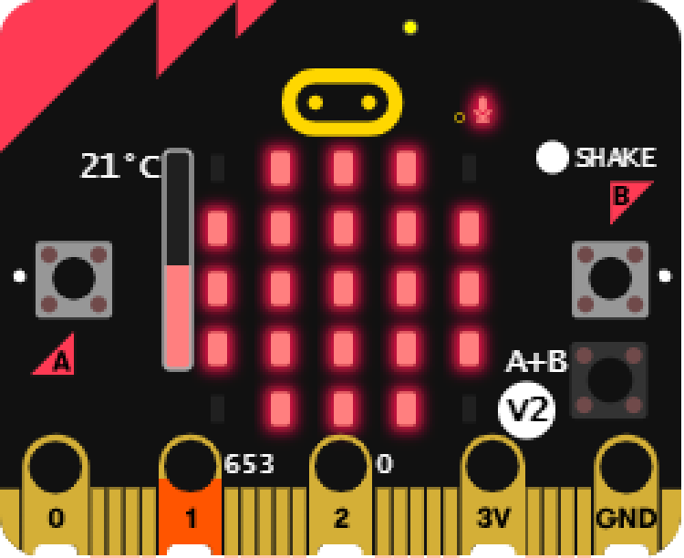

> Open this page at [https://simpletonperson.github.io/clarey-microbit/](https://simpletonperson.github.io/clarey-microbit/)
# clarey:bit

### A micro:bit project made with love. ❤️

## About
clarey:bit is a MSITAU project mainly worked on by me. (SimiPers)

Every design or image that i have made is inspired by the micro:bit brand and logos, I am NOT associated with the Micro:bit Educational Foundation.
This project is only usable on the micro:bit V2, the project uses the data logger extension, a block that enables the built-in speaker, an action that requires the logo to be pressed.

## Features

All images provided here is taken from the Microsoft MakeCode for micro:bit, i simply don't own a micro:bit. (Yes, i'm crazy.)

### Thermometer

Wanted to see how warm or cold it is by just 3 images?
**Shake.**
***Shake the micro:bit.***
***Shaky, shaky, shaky, shaky, shaky, shaky, shaky, shaky, shaky, shaky, shaky :)***

### Record-And-Playback

By pressing onto P1, you can start recording!
After pressing P2, you will hear what you said.
Recordings will not save onto the device in any way. (Atleast, i think.)

### ???

I'm not telling you how to do it, just figure it out yourself.

## Use as Extension

This repository can be added as an **extension** in MakeCode.

* open [https://makecode.microbit.org/](https://makecode.microbit.org/)
* click on **New Project**
* click on **Extensions** under the gearwheel menu
* search for **https://github.com/simpletonperson/clarey-microbit** and import

## Edit this project

To edit this repository in MakeCode.

* open [https://makecode.microbit.org/](https://makecode.microbit.org/)
* click on **Import** then click on **Import URL**
* paste **https://github.com/simpletonperson/clarey-microbit** and click import

#### Metadata (used for search, rendering)

* for PXT/microbit

#### Info

Everything here, from the screenshots to the mentions of the device, is all owned by the [Micro:bit Educational Foundation](https://microbit.org).
Thank you to micro:bit and everyone that worked hard into the device for giving young kids and everyone a chance to make things on a device. :heart:
